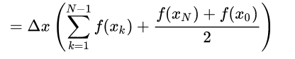
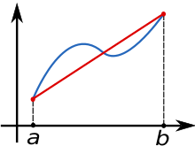
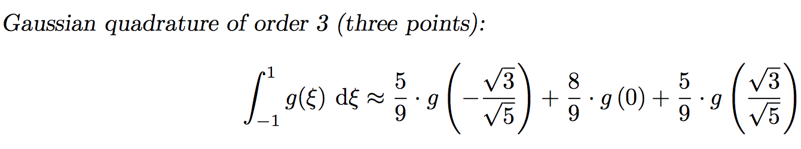
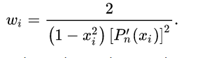

# Integrals

## Trapezoidal Rule

Approximate the integral of a function as a trapezoid or a sum of trapezoids, calculating its areas.

## Simpsons 1/3rd Rule
Evenly spaced partitions, the sum approximation is an average of the midpoint integral rule and trapezoidal rules.
## 3 Point Gaussian
Th weighted sum of function values at data points within the domain.

 The weights are Legendre polynomials, found below.

