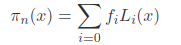
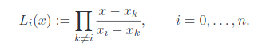
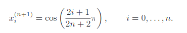
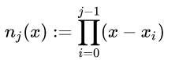
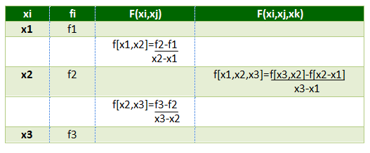

# Interpolation

## Lagrange Interpolation
The quation for lagrange interpolation starts with  which uses the polynomial described by . So we basically make n different polynomials and add them together to interpolate the input data set.

One makes also use of the Tschebyscheff nodes from the equation  to help counter act the random oscillations that come with evenly spaced points along an interval.

## Newton's Divided Difference
Newton's method uses the basis polynomials  which have coefficients determined by divided differences 

## Splines
For splines, we create n -1 different polynomials that are differential at the n points such that they are continuous. 
