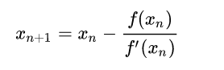
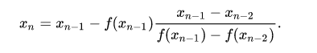
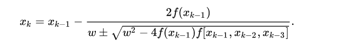

# Root finding algorithms

### Bisection Method

Start with two guesses such that f(guess_1) and f(guess_2) are of opposite sign. This means that we have one guess that’s too large and another guess that’s too small, then gradually squeeze the guess that’s too high and the guess that’s too low towards zero until the range between the two is small enough or equal to zero.

At each step take the midpoint of the two guesses. If the midpoint is zero (the guesses are the same) or if the guesses are sufficiently close to one another, return the midpoint. Otherwise, if the f(midpoint) is negative, then replace the lower bound with the midpoint, and if f(midpoint) is positive, then replace the upper bound with the midpoint.

### Newton Raphson Method

The derivative tells us about the direction and step size to take on reasonably convex, continuous, well-behaved functions; all that is needed is find a point on the curve where the derivative is zero

For Newton-Raphson, we supply an initial guess, calculate the derivative of f at the initial guess, calculate where the derivative intersects the x-axis, and use that as our next guess.  The method can be extended to n dimensions with the Jacobian and/or higher orders of the Taylor series expansion regarding the derivative approximation.

#### Downfalls
If we supply an initial guess in a function that has a local minimum located in a different direction than the root (the tangent line is drawn away from the root), we will never get to a point of inflection (enter gradient descent XD).  

### Quasi-Newtonian: Secant Method

The idea of the Quasi-Newtonian Secant Method and other Quasi-Newtonian methods is to substitute the expensive calculation of the derivative/Jacobian/Hessian at each step with an inexpensive but good-enough approximation.

Secent-Method is "derivative-like": approximate the derivative using two points (x0, f(x0)) and (x1, f(x1)), calculate where the line intercepts the x-axis, and use that as one of our new points, generating a line that should approximate the tangent line to the function somewhere between these two points

### Muellers Method

Faster than bisection and secant method, Muellers method overcomes the calculating of derivatives at each step by interpolating a second degree polynomial on top of three initial roots of a function. We then find the root of this polynomial P(x) = c + b(x-x_2) + a(x-x_2)^2 such that:

## Why does it matter?

The rate of convergence is of great importance in computing, i.e.,
the computational expense in each step of the iteration.
